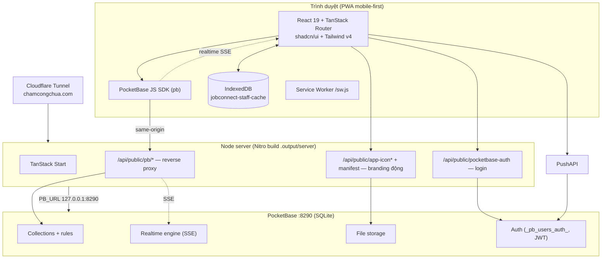
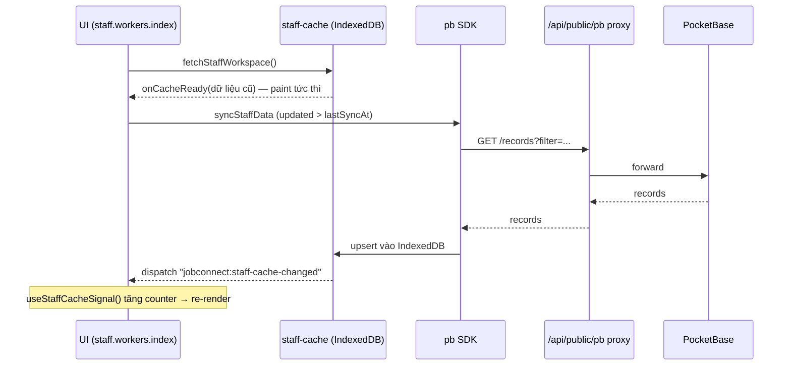
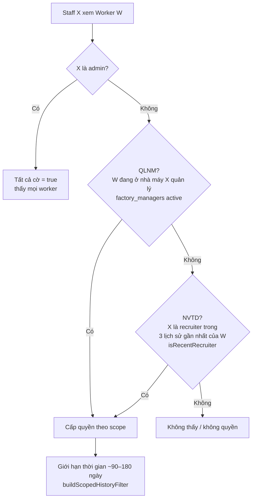
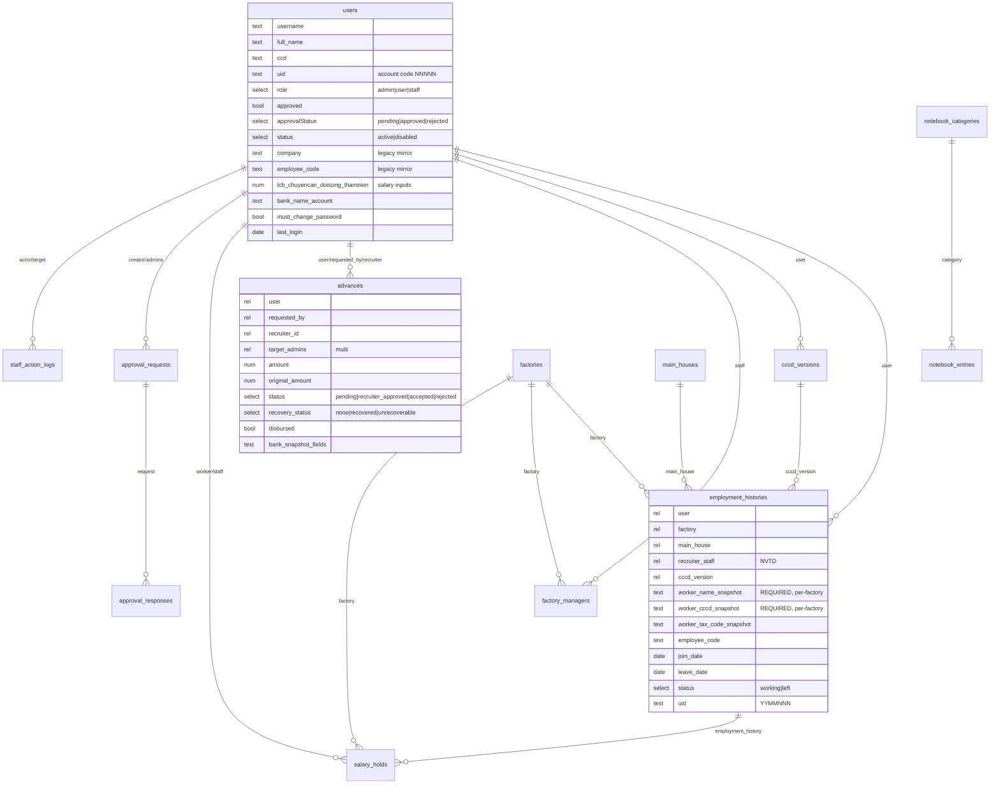
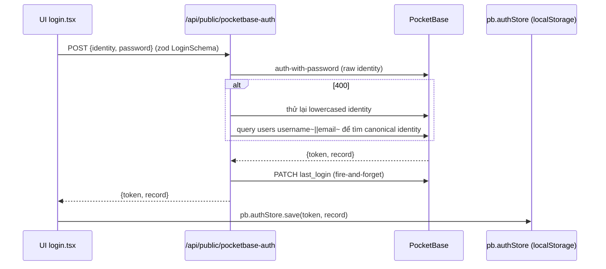
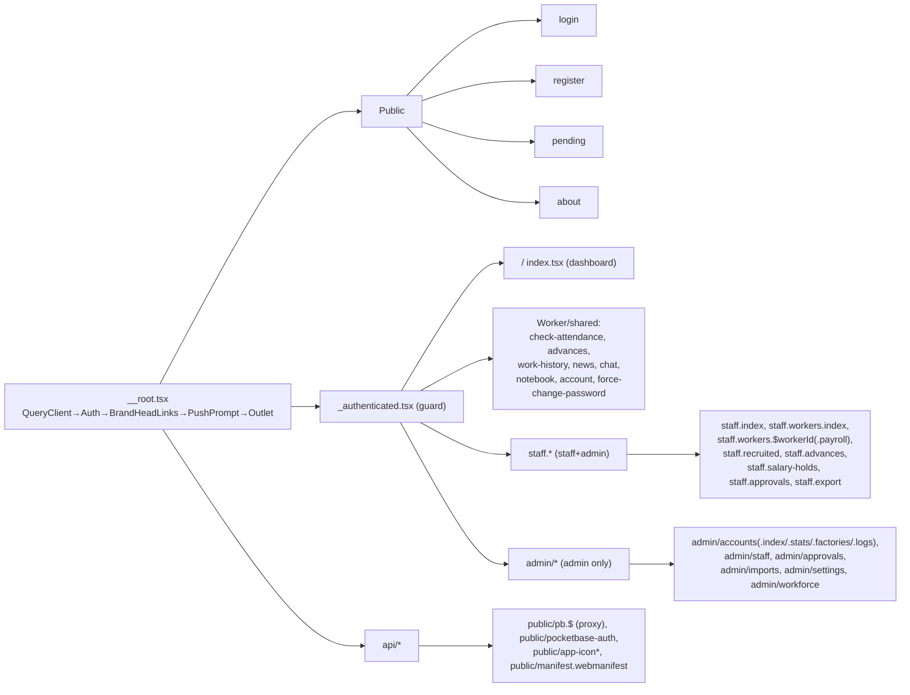
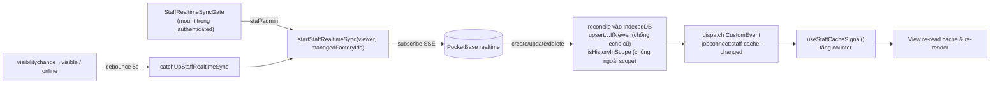
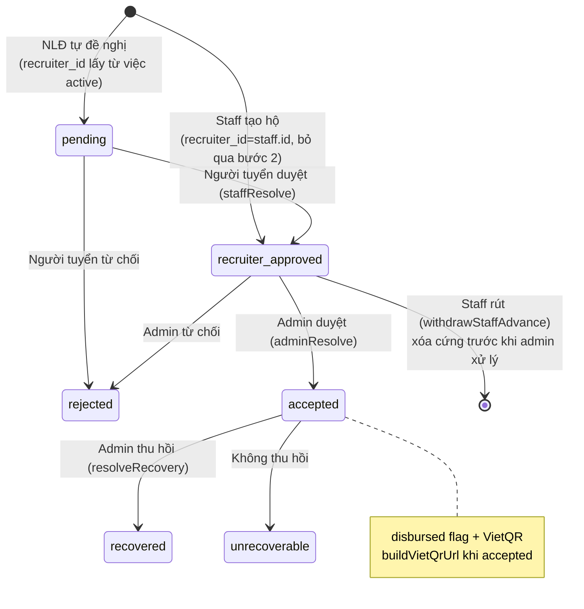
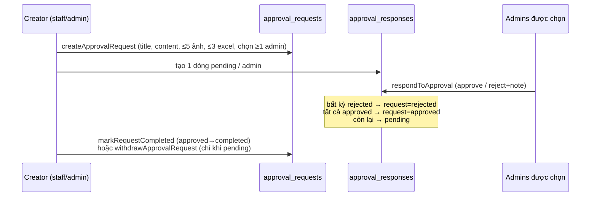
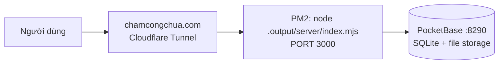

# JobConnect (Hoàng Long DJC) — Blueprint Tái Dựng Ứng Dụng

> Tài liệu này mô tả đầy đủ **kiến trúc, mô hình dữ liệu, logic nghiệp vụ, luồng hoạt động và các thành phần liên quan** của ứng dụng, đủ để một developer hoặc AI dựng lại app từ đầu mà không cần đọc source gốc.
>
> App là một **PWA mobile-first tiếng Việt** dùng để **quản lý lao động khu công nghiệp**: kết nối người lao động (NLĐ), người tuyển dụng (staff/NVTD) và quản trị viên (admin). Xử lý chấm công, lương, tạm ứng, giữ lương, phê duyệt, lịch sử đi làm, tuyển dụng, chat và một vài game giải trí.

---

## Mục lục

1. [Tech stack & quyết định kiến trúc](#1-tech-stack--quyết-định-kiến-trúc)
2. [Sơ đồ kiến trúc tổng thể](#2-sơ-đồ-kiến-trúc-tổng-thể)
3. [Vai trò & phân quyền](#3-vai-trò--phân-quyền)
4. [Mô hình dữ liệu (PocketBase collections)](#4-mô-hình-dữ-liệu-pocketbase-collections)
5. [Xác thực & luồng auth](#5-xác-thực--luồng-auth)
6. [Cấu trúc route & shell](#6-cấu-trúc-route--shell)
7. [Tầng dữ liệu: cache + realtime](#7-tầng-dữ-liệu-cache--realtime)
8. [Các luồng nghiệp vụ chính](#8-các-luồng-nghiệp-vụ-chính)
9. [Server API (Nitro handlers)](#9-server-api-nitro-handlers)
10. [Tích hợp: VietQR, Excel, CCCD QR](#10-tích-hợp-vietqr-excel-cccd-qr)
11. [Quy ước UI/UX & thư mục](#11-quy-ước-uiux--thư-mục)
12. [Cấu hình & triển khai](#12-cấu-hình--triển-khai)
13. [Checklist dựng lại từ đầu](#13-checklist-dựng-lại-từ-đầu)

---

## 1. Tech stack & quyết định kiến trúc

| Lớp          | Công nghệ                                                    | Ghi chú                                                                |
| ------------ | ------------------------------------------------------------ | ---------------------------------------------------------------------- |
| Frontend     | **React 19.2**                                               | JSX transform mới                                                      |
| Routing      | **TanStack Router 1.168** (file-based)                       | Sinh `src/routeTree.gen.ts` tự động qua `@tanstack/router-plugin`      |
| SSR / server | **TanStack Start 1.167** trên **Nitro**                      | `server.handlers` cho API routes; không có tRPC/Express/Hono           |
| Server-state | **TanStack Query 5.83**                                      | Dùng rất ít — chủ yếu cho `useAppSettings`                             |
| Backend      | **PocketBase 0.26** (BaaS, SQLite)                           | Là ORM/DB/auth/realtime duy nhất, truy cập qua SDK `pocketbase@0.26.9` |
| UI           | **shadcn/ui** (style "new-york") + **Radix UI** (~30 gói)    | Icon: `lucide-react`                                                   |
| CSS          | **Tailwind CSS v4** qua `@tailwindcss/vite`                  | Không có `tailwind.config`; biến CSS trong `src/styles.css`            |
| Animation    | **framer-motion 12**                                         |                                                                        |
| Toast        | **sonner**                                                   | `<Toaster richColors position="top-center">`                           |
| Charts       | **recharts** (qua `ui/chart.tsx`)                            |                                                                        |
| Excel        | **xlsx (SheetJS)** + `file-saver` + `jszip`                  | Import/export chấm công, lương, lịch sử                                |
| QR           | **jsqr**                                                     | Đọc QR CCCD                                                            |
| Validation   | **zod 3.24**                                                 | Chỉ dùng 1 chỗ (login schema); phần còn lại validate thủ công          |
| Build        | **Vite 7.3** + `@lovable.dev/vite-tanstack-config`           | App scaffold từ Lovable                                                |
| Deploy       | **PM2** (Node server) sau Cloudflare Tunnel; **Netlify** phụ | Cloudflare Workers scaffold có nhưng tắt                               |

**Quyết định kiến trúc quan trọng (phải giữ khi dựng lại):**

- **Không có schema Drizzle/Prisma, không có `src/db` hay `src/server`.** Toàn bộ schema + access rules nằm trong PocketBase. Định nghĩa collection được checked-in dưới dạng JSON tại `docs/pocketbase/*.json` để import qua Admin UI.
- **Phần lớn logic chạy ở client**, gọi thẳng PocketBase SDK. Bảo mật dựa vào **PocketBase collection rules**. Lý do: rule của PocketBase không diễn đạt được logic "người tuyển trong 3 lịch sử gần nhất", nên quyền chi tiết được tính ở frontend (`staff-permissions.ts`).
- **Trình duyệt không nói chuyện trực tiếp với PocketBase.** Mọi traffic đi qua **reverse proxy same-origin** `/api/public/pb/*` (giữ CORS, passthrough SSE realtime, bọc lỗi upstream thành thông báo tiếng Việt thân thiện).
- **Auth chỉ enforce ở client** (`beforeLoad` bail khi SSR) vì token nằm trong localStorage — tránh vòng lặp redirect khi SSR.

---

## 2. Sơ đồ kiến trúc tổng thể



**Luồng request điển hình (đọc dữ liệu worker):**



---

## 3. Vai trò & phân quyền

Ba vai trò trong field `users.role`:

| Role               | Nghĩa                   | Nav dưới cùng                               |
| ------------------ | ----------------------- | ------------------------------------------- |
| `admin`            | Quản trị viên           | Trang chủ / Cài đặt / Nhập liệu / Tài khoản |
| `staff`            | Người tuyển / NVTD (HR) | Staff / Lao động / Tài khoản / Xuất file    |
| `user` (hoặc rỗng) | Người lao động (NLĐ)    | Trang chủ / Tài khoản / Về chúng tôi        |

> Không có role "recruiter" riêng — **người tuyển là staff**. Quan hệ "người tuyển" được mã hóa qua `employment_histories.recruiter_staff` và `advances.recruiter_id`.

### Phân quyền chi tiết theo worker (`src/lib/staff-permissions.ts`)

Đây là **lõi phân quyền**. Với mỗi worker, tính ra các cờ: `canReportAdvance`, `canUpdateBank`, `canViewPayroll`, `canReportLeave`, `canReportJoin`, `canEditHistory`.



- **QLNM** (quản lý nhà máy): `getManagedFactoryIds` từ `fetchFactoryManagers` + `isFactoryAssignmentActive`.
- **NVTD** (người tôi tuyển): `isRecentRecruiter` — recruiter nằm trong 3 lịch sử mới nhất.
- Scope được **giới hạn thời gian** (`hasActiveOrRecentlyLeftEmployment`, cửa sổ 180 ngày) và dùng chung cho cả fetch lẫn subscription realtime (`buildScopedHistoryFilter`).
- `escapePb` / `relationInFilter` (`delegations.ts`) build chuỗi filter PocketBase an toàn.

### Route guards (`beforeLoad`, chỉ chạy client)

- `_authenticated.tsx`: chưa auth → `/login?redirect=…`; chưa duyệt → `/pending`; `must_change_password` → `/force-change-password`.
- `index.tsx` (`/`): staff → `/staff`.
- `staff.tsx`: chỉ staff+admin (`canAccessStaffWorkspace`), khác → `/`.
- `admin/*`: `role !== "admin"` → `/` (riêng `admin/approvals` → `/news`).
- `login.tsx`: đã auth → `/`.

---

## 4. Mô hình dữ liệu (PocketBase collections)

> PocketBase tự thêm `id` (text 15 ký tự), `created`, `updated` cho mọi collection. `users` là collection auth built-in `_pb_users_auth_`.

### Sơ đồ quan hệ (ERD)



### Collections có JSON checked-in (`docs/pocketbase/`)

**`factories`** — `code` (unique nếu có), `name` (required, unique), `address`, `hotline`, `attendance_cutoff_day` (int 1–31, dùng cho chu kỳ lương), `status` (`active|inactive`), `note`. Rule: list/view mọi authed; create/update/delete admin.

**`factory_managers`** (QLNM) — `factory` (rel cascade), `staff` (rel cascade), `active_from`, `active_to`, `status`, `note`. Unique (`factory`,`staff`,`active_from`). Rule: view mọi authed; ghi admin.

**`employment_histories`** (lõi workforce) — xem ERD. **Điểm quan trọng:** `worker_name_snapshot` / `worker_cccd_snapshot` / `worker_tax_code_snapshot` là **snapshot theo từng record**, tách biệt với `user.full_name` / `user.ccd` hiện tại (một worker có thể từng làm dưới tên/CCCD khác). Form phải cho nhập độc lập ("Họ tên tại NM" / "CCCD tại NM"). **Unique `idx_emphist_one_active` on (`user`) WHERE status='working'** — mỗi user chỉ 1 việc active. Rule: view = admin|staff|owner; create = admin|staff; update = admin|staff|owner; delete = admin.

**`cccd_versions`** — `user`, `cccd_number`, `front_image`/`back_image` (file ≤5MB, thumb 300x200), `is_current`, `note`. Unique (`user`,`cccd_number`).

**`staff_action_logs`** (audit) — `actor`, `actor_role_snapshot`, `target_user`, `target_collection`, `target_record`, `action` (`create|update|delete|export|import|report_advance|report_leave|report_join|update_bank|check_payroll`), `before` (json), `after` (json), `note`. Rule: create = mọi authed; view/update/delete admin.

**`salary_holds`** (giữ lương) — `worker`, `employment_history`, `staff`, `factory`, `worker_name`, `company_name`, `staff_bank_*`, `amount` (int ≥1), `content`, `status` (`received|approved|rejected|disbursed|cancelled`), `*_by`/`*_at`. **State-machine enforce ngay trong PocketBase rule:** create khi `staff=auth.id && status="received" && employment_history.recruiter_staff=auth.id`; update: admin `received→approved|rejected`, `approved→disbursed`; staff owner `received→cancelled`; delete: tắt.

**`approval_requests`** — `title`, `content`, `images` (≤5), `excel_files` (≤3), `creator`, `admins` (rel multi 1–99), `status` (`pending|approved|rejected|completed`), `completed_at`.

**`approval_responses`** — 1 dòng/admin: `request` (cascade), `admin`, `status` (`pending|approved|rejected`), `note`, `responded_at`.

**`notebook_categories`** / **`notebook_entries`** — sổ tay riêng tư per-user (mọi rule scope `created_by = auth.id`). Entry: `date`, `category`, `worker`, `other_person`, `amount`, `note`, `status`.

### Collections chỉ suy ra từ code (tồn tại trong PocketBase live, chưa có JSON)

> Tên field chính xác từ TS types + payload `.create()/.update()`; **constraint/rule cấp PocketBase phải tự định nghĩa lại**.

- **`advances`** (tạm ứng) — xem ERD + §8.1. Full field: `user, requested_by, recruiter_id, target_admins[], employee_code, full_name, company, phone, join_date, bank_name, bank_account_number, bank_account_name, amount, original_amount, reason, status, recovery_status, admin_note, recruiter_note, recovery_note, resolved_at, recovered_at, disbursed, disbursed_at`.
- **`check_attendance_batches` / `check_attendance_items`** — sheet chấm công import. Batch: `month, round_no, note, total_users, total_rows, source_file`. Item: `batch, user, month, round_no, rows[] (json), summary (json)`.
- **`check_salary_batches` / `check_salary_items`** — sheet lương import. Item: `batch, user, month, round_no, personal, wage_lines, allowance_lines, deduction_lines, totals` (đều json).
- **`recruitments`** (bảng tin) + **`recruitment_areas`** — Recruitment nhiều field mô tả tuyển dụng (`company, area, images[], map_url, introduction, interview_time, recruitment_deadline, employment_type, is_active, gender[], salary_base, allowance, bonus_other, short_term_salary, environment, work_posture, production_qc, documents, notes, admin_phone`).
- **`main_houses`** — `name, address, hotline, note`.
- **Chat**: `chat_rooms` (`name, description, is_default, created_by`), `chat_room_members` (`room, user`), `chat_join_requests` (`room, user, status, handled_by, handled_at`), `group_chat_messages` (`user, room, content`).
- **`app_settings`** — singleton (getList(1,1)). Field: `company_name, slogan, address, hotline, email, about, logo (file), requireApproval, account_code_prefix, advance_limit, advance_rules, allow_advance_after_leave, advance_reporting_enabled, install_guide_images[]`, + branding icons.

---

## 5. Xác thực & luồng auth



- **Password hashing / JWT / session** hoàn toàn do **PocketBase** xử lý (`_pb_users_auth_`). App không tự hash.
- `login()` (trong `auth.tsx`) **không gọi PB trực tiếp** — POST tới server route rồi mới `pb.authStore.save`. Login **case-insensitive** và username/email dùng thay nhau (canonicalize ở server).
- `AuthProvider` khi mount: nếu `pb.authStore.isValid` → `authRefresh()` (dedupe + timeout 3.5s) để validate; lỗi → clear store.
- `logout()`: stop realtime sync → clear authStore → clear IndexedDB cache.
- **Approval**: `getApprovalStatus` — admin luôn approved; ưu tiên `approvalStatus`, fallback `approved`. `isUserApproved` gác cửa authenticated area.

---

## 6. Cấu trúc route & shell

File-based dưới `src/routes/`, compile thành `src/routeTree.gen.ts` (auto-gen, **không sửa tay**). 53 file route.

### Quy ước

- `__root.tsx` — shell + providers.
- `_authenticated.tsx` — **pathless layout** (underscore = không có segment URL), chứa auth guard + `<BottomNav>` + `<StaffRealtimeSyncGate>`.
- Dot-notation: `staff.workers.index.tsx` → `/staff/workers`; `staff.workers.$workerId.tsx` → `/staff/workers/:workerId`; `.payroll.tsx` → thêm `/payroll`.
- `api/` — Nitro handlers (`server.handlers`, không component).

### Cây route



### Shell (`__root.tsx`)

- `head()`: meta viewport `viewport-fit=cover`, `theme-color #0e6b7a`, title "Hoàng Long DJC", Google Fonts (Noto Sans), manifest link, apple-touch/favicon trỏ tới `/api/public/app-icon` (động).
- `RootComponent`: `QueryClientProvider` → `AuthProvider` → `BrandHeadLinks` + `PushPermissionPrompt` + `.app-shell` (`Outlet` + `Toaster`). On mount đăng ký `/sw.js`, cài PWA prompt listener.
- `ErrorComponent`: auto reload **1 lần** khi lỗi chunk-load (deploy cũ) qua sentinel `sessionStorage`.

### Nav & layout

- `BottomNav.tsx` — nav cố định theo role, max-width 30rem, glassy `backdrop-blur`, safe-area aware. Active = prefix khớp dài nhất. Cũng export `AppHeader` (sticky top: back + title/subtitle + right slot).
- Mobile-first: `100dvh`, safe-area insets, tile grid `grid-cols-2 sm:grid-cols-3`. `login.tsx` là ví dụ responsive rõ nhất (mobile stack → desktop `lg:` split 2 cột). **Không có dark-mode toggle** (biến CSS có nhưng không có switcher runtime).

---

## 7. Tầng dữ liệu: cache + realtime

Đây là hạ tầng cross-cutting quan trọng nhất cho các view staff/admin.

### 7.1 IndexedDB cache (`src/lib/staff-cache.ts`)

- DB `jobconnect-staff-cache` (version 5), object stores: `employment_histories`, `users`, `cccd_versions`, `factories`, `main_houses`, `staff_users`, `_meta`.
- **Incremental sync**: track `lastSyncAt`, chỉ fetch record `updated > lastSyncAt`.
- **Scope fingerprint** (viewer id + managed factory ids) — đổi scope thì invalidate cache.
- `fetchStaffWorkspace`: đọc cache trước (gọi `onCacheReady` để paint tức thì) → sync fresh. Đây là pattern **cache-first, revalidate** làm thủ công, không qua TanStack Query.

### 7.2 Realtime (`src/lib/realtime-sync.ts`)



- Subscribe 5 collection: `employment_histories` (scoped filter + expand), `users`, `cccd_versions`, `factories`, `main_houses`.
- SSE đi qua proxy `/api/public/pb` (proxy passthrough `text/event-stream`).
- **Catch-up**: khi tab visible trở lại hoặc online → re-sync (debounce 5s) để bù gap.
- `stopStaffRealtimeSync()` gọi khi logout.
- Chat (`chat.tsx`) subscribe riêng `group_chat_messages`.

---

## 8. Các luồng nghiệp vụ chính

### 8.1 Tạm ứng (Advances) — luồng 3 bước

**Status model** (`src/lib/advances.ts`):

- `AdvanceStatus = pending | recruiter_approved | accepted | rejected`.
- `RecoveryStatus = none | recovered | unrecoverable` (trục riêng, chỉ có nghĩa sau khi `accepted`).
- `disbursed` (bool) + `disbursed_at`: theo dõi giải ngân thực tế, độc lập status.
- `original_amount`: giữ số tiền trước khi admin sửa.



- **Bước 1 — NLĐ đề nghị**: tạo `status=pending`, `recruiter_id` từ việc active (`findActiveEmploymentByUser`). Không có việc active → chặn. Check hạn mức client-side.
- **Bước 2 — Người tuyển (staff) duyệt**: `pending → recruiter_approved | rejected`. Staff cũng có thể **tạo hộ** (`createWorkerAdvance`) → bắt đầu thẳng ở `recruiter_approved`. Staff **rút** (`withdrawStaffAdvance`) request `recruiter_approved` của mình trước khi admin xử lý (xóa cứng + log; guard `ADVANCE_NOT_WITHDRAWABLE` đọc lại record trước).
- **Bước 3 — Admin chốt**: `adminResolve` → `accepted | rejected`. Bulk approve/reject (`bulkUpdate`), sửa amount (`saveEditedAmount`, giữ `original_amount`), thu hồi (`resolveRecovery`/`bulkResolveRecovery`), giải ngân (`setDisbursed`). Mỗi mutation ghi `createStaffActionLog`.
- **Staff tự ứng** (`MyAdvancesView`): `recruiter_id=""`, `status=recruiter_approved`, chọn `target_admins` (multi-select) → bỏ qua bước 2, thẳng tới admin.
- **Hạn mức/thu hồi**: `advance_limit` (settings). Outstanding = tổng `pending + recruiter_approved + accepted-with-recovery none`. Available = limit − outstanding; chặn nếu vượt.
- **VietQR**: `buildVietQrUrl` hiện QR trong dialog khi `accepted`, dùng bank + amount + template mô tả chuyển khoản (`buildTransferDescription`, `+ tên` → full name bỏ dấu; template lưu localStorage).
- **Swipe nav** (`AdvanceDetailDialog`): xem từng card, chevron trái/phải + phím mũi tên + touch swipe (ngưỡng 50px). ArrowRight khi `canDisburse` → đánh dấu disbursed rồi sang card tiếp ("dây chuyền giải ngân").
- **Filter** (`buildAdvanceFilter`): scope theo role (admin tất cả; staff `recruiter_id=me||requested_by=me`; worker `user=me`) + tab/status + factory + date range + disbursement + search. Persist vào localStorage `jobconnect.advanceFilters`.

### 8.2 Phê duyệt (Approvals) — request-based



- Label: pending "Chờ duyệt", approved "Đã duyệt", rejected "Từ chối", completed "Hoàn thành".
- List filter: admin thấy `admins~me || creator=me`; staff chỉ `creator=me`. Admin có "Xóa dữ liệu cũ" (`deleteOldRequests` theo ngày) + nút phản hồi (`canRespond = isAdmin && request.pending && myResponse.pending`).
- **Feature khác cùng tên** — `admin/approvals.tsx`: duyệt **đăng ký tài khoản** (`users.approvalStatus=pending`); approve → set `approved/status/active` + `assignUidIfMissing`; reject → xóa user. Bulk + log + export Excel.

### 8.3 Lịch sử đi làm & snapshot (`employment.ts`, `WorkerEmploymentDrawer.tsx`)

- **Snapshot per-record**: `worker_name_snapshot` / `worker_cccd_snapshot` / `worker_tax_code_snapshot` lưu riêng mỗi history, khác `user.full_name`/`user.ccd`. Form mở input độc lập ("Họ tên tại NM" / "CCCD tại NM" / "Mã số thuế"), default từ history mới nhất hoặc user nhưng sửa tự do. Header account hiện tên/CCCD account (masked) tách biệt từng card.
- **Derive status**: `deriveEmploymentStatus`/`isCurrentlyWorking` — "working" nếu chưa có leave hoặc leave ở tương lai; "left" nếu leave ≤ hôm nay. `getLatestEmploymentHistory` chọn mới nhất; `syncLegacyUserWorkFields` mirror ngược `user.employee_code/company`.
- **Thêm lịch sử cũ** (admin, `canAddOldHistory`): luôn `status=left`, validate join≤leave≤today + không overlap. UID `buildHistoryUid`/`generateEmploymentHistoryUid` (`{prefix}{yy}{mm}{nnn}`).
- Drawer còn: sửa bank inline (`canUpdateBank`), report advance cho worker active (`canReportAdvance`), quản lý ảnh CCCD (`CccdManager`). Tất cả log qua `createStaffActionLog`.

### 8.4 Giữ lương (Salary holds)

Status `received → approved → disbursed`, hoặc `→ rejected` / `→ cancelled`. Staff tạo cho worker mình tuyển; admin duyệt/giải ngân (có VietQR). State-machine enforce bằng PocketBase rule (xem §4). `buildSalaryHoldTransferDescription` bỏ dấu tiếng Việt cho memo chuyển khoản.

### 8.5 Chấm công & lương (`salary.ts`, `payroll-cycle.ts`)

- `calcSalary`: rate buckets **100/130/150/200/270/300/390** + phụ cấp chuyên cần / đời sống / thâm niên. `distributeDay`/`aggregate`.
- `getPayrollPeriod`: chu kỳ lương theo `factory.attendance_cutoff_day`, sinh cell lịch.
- Xem sheet công/lương import (`check-attendance.tsx`).

### 8.6 Dashboard (`index.tsx`, `staff.index.tsx`)

- **Admin/User home**: hero gradient (logo/tên/slogan từ `useAppSettings`), badge role, tổng hợp **unread** (news, chat per-room qua `chat_room_members`/`group_chat_messages` + `getSeen`, check công/lương, advance responses). Section "Quản trị" chỉ admin. Tile worker "khi đã đi làm" **disabled trừ khi** `user.employee_code && user.company` được admin set (`workDisabled` → tile khóa + dialog giải thích).
- **Staff dashboard**: 2 `StatCard` (nhà máy phụ trách active, số lao động trong quyền) + tile điều hướng.

---

## 9. Server API (Nitro handlers)

| Route                                                      | File                            | Vai trò                                                                                                                      |
| ---------------------------------------------------------- | ------------------------------- | ---------------------------------------------------------------------------------------------------------------------------- |
| `POST /api/public/pocketbase-auth`                         | `api/public/pocketbase-auth.ts` | Login proxy: zod validate → PB `auth-with-password` → canonicalize identity → patch `last_login`                             |
| `ALL /api/public/pb/*`                                     | `api/public/pb.$.ts`            | **Reverse proxy** PocketBase: CORS + `ngrok-skip-browser-warning` + SSE passthrough + map 5xx → thông báo offline tiếng Việt |
| `GET /api/public/app-logo`, `app-icon`, `app-icon-192/512` | tương ứng                       | Branding động từ `app_settings`                                                                                              |
| `GET /api/public/manifest.webmanifest`                     | `manifest.webmanifest.ts`       | PWA manifest động                                                                                                            |

> Đây là **toàn bộ** server function thực sự. Không có `createServerFn`; mọi CRUD khác đi qua PB SDK ở client.

---

## 10. Tích hợp: VietQR, Excel, CCCD QR

- **VietQR** (`vn-banks.ts`): `VN_BANKS` map code/name/BIN. `buildVietQrUrl` → `https://img.vietqr.io/image/{BIN}-{account}-compact2.png?amount=&addInfo=&accountName=` (null nếu thiếu BIN/account). `resolveBankName` fuzzy match. Dùng ở advances (khi accepted) và salary holds (khi approved).
- **Excel** (`excel.ts` + `xlsx`): `parseExcelToRows(FromUrl)`, `exportToExcel`. Importers:
  - `admin/imports.tsx`: `importHistories` (create/update `employment_histories`; match user theo UID→username, factory theo name/code, recruiter theo username; enforce "one active job"; export failed-rows) + `bulkEditHistories` (match 3 tầng: UID+empCode, empCode+factory, factory+joinDate).
  - `check-attendance.tsx`: import `check_attendance_batches/items` + `check_salary_batches/items`.
  - **Log import chỉ 1 dòng summary**: mỗi importer build 1 chuỗi tổng (vd `Lịch sử đi làm: tạo X, cập nhật Y, lỗi Z`), toast + ghi **1** `staff_action_logs` action `import` với `after` JSON `{created,updated,failed,file}` — **không log từng record**. Failed rows export ra Excel riêng.
- **File upload**: qua PocketBase `file` field (multipart FormData); ảnh nén client trước upload (`image-compress.ts`).
- **CCCD QR** (`cccd-qr.ts`): `scanCccdQrFromFile` parse QR CCCD VN để autofill form; `cccd-versions.ts` quản lý ảnh CCCD versioned.

---

## 11. Quy ước UI/UX & thư mục

### Cấu trúc `src/`

```
src/
├─ router.tsx          # tạo router + QueryClient
├─ server.ts           # Nitro entry (bọc TanStack Start server)
├─ start.ts            # TanStack Start instance + middleware
├─ routeTree.gen.ts    # AUTO-GEN, không sửa
├─ styles.css          # Tailwind v4 + biến CSS
├─ routes/             # file-based routes (xem §6)
│  └─ api/             # Nitro handlers
├─ components/
│  ├─ ui/              # ~50 shadcn primitives + stat-card, status-chip, empty-state, filter-bar
│  ├─ layout/          # BottomNav(+AppHeader), PageContainer, BackButton, install prompts
│  ├─ dashboard/       # FeatureTile
│  ├─ approvals/       # ApprovalForm, ApprovalDetail, ImageViewer, ExcelPreview
│  ├─ staff/           # WorkerQuickDrawer(+ScopeChip), QuickWorkerAccountDialog, SalaryHoldCreateDialog, BankNameInput, StaffRealtimeSyncGate
│  ├─ employment/      # WorkerEmploymentDrawer, UserWorkHistoryPanel
│  ├─ workforce/       # RegisterDialog, UserPicker, RecruitChartDialog
│  ├─ cccd/            # CccdManager, CccdVersionViewer
│  ├─ factories/       # FactoryManagersDialog
│  ├─ users/           # UserCombobox
│  ├─ admin/           # AccountActivityStats
├─ hooks/              # use-mobile.tsx (còn lại là hooks trong lib/)
└─ lib/                # logic nghiệp vụ + data (xem bên dưới)
```

`src/lib/` chia nhóm: **infra/data** (`pocketbase.ts`, `pocketbase-config.ts`, `staff-cache.ts`, `realtime-sync.ts`, `use-staff-cache-signal.ts`, `delegations.ts`), **auth/authz** (`auth.tsx`, `user-approval.ts`, `staff-permissions.ts`, `profile.ts`, `account-identity.ts`, `uid.ts`), **domain** (`employment.ts`, `factories.ts`, `main-houses.ts`, `salary.ts`, `payroll-cycle.ts`, `advances.ts`, `salary-holds.ts`, `approval-requests.ts`, `cccd-qr.ts`, `cccd-versions.ts`, `staff-log.ts`, `app-settings.ts`), **utils** (`utils.ts` `cn()`, `money.ts`, `date-utils.ts`, `vn-banks.ts`, `excel.ts`, `image-compress.ts`, `seen.ts`), **PWA/push/SSR** (`pwa-install.ts`, `push-notifications.ts`, `push-server.ts`, `error-capture.ts`, `error-page.ts`, `server-app-brand.ts`).

> Không có barrel `index.ts`; import trực tiếp qua alias `@/`.

### Patterns UI bắt buộc giữ

- **Form thủ công**: không dùng react-hook-form/zod/TanStack Form ở UI. `useState` per-field + `<form onSubmit>` / button `onClick`, validate bằng early-return + `toast.error`.
- **Dialog/Drawer pattern**: shadcn `Dialog`/`Drawer` controlled (`open`/`onOpenChange`), `DialogHeader/Title/Description`, body field stateful, `DialogFooter` Cancel + submit hiện label pending ("Đang lưu…"). Lỗi field PB surface qua `getPocketBaseFieldErrors`.
- **Money**: `formatMoneyInput`/`parseMoneyInput`. **Date**: `<input type="date">` với min/max. **Bank**: `VN_BANKS` select/datalist.
- **Audit**: gần như mọi write đi kèm `createStaffActionLog` → hiển thị ở `admin/accounts.logs.tsx`.
- **StatusChip** tones: neutral/info/success/warning/danger/primary. **Worker card**: `list-card` inline (tên, mã NV, CCCD masked, MST, factory, recruiter, main house, StatusChip). Tap → `WorkerEmploymentDrawer`.

---

## 12. Cấu hình & triển khai

### Biến môi trường (`.env`)

```
PB_URL=http://127.0.0.1:8290          # PocketBase upstream (server/SSR)
VITE_PB_URL=http://127.0.0.1:8290
```

### URL resolution (`pocketbase-config.ts`)

- Client: `window.__PB_URL__` (runtime override) → nếu không có, `${window.location.origin}/api/public/pb` (same-origin proxy).
- Server/build: `PB_URL` / `VITE_PB_URL` env, mặc định `http://127.0.0.1:8290`. `getPBUpstream()` trả upstream trực tiếp cho handler server.

### Scripts

`dev` (vite dev, `127.0.0.1:3000`), `build`, `start` (`node .output/server/index.mjs`), `lint`, `format`, `deploy:pm2` (build + pm2 reload), `deploy:full` (install + deploy).

### Luồng production



Deploy phụ: Netlify (`netlify.toml`, publish `dist/client`, Node 22, `NETLIFY=true` → chọn plugin netlify thay nitro). Cloudflare Workers scaffold (`wrangler.jsonc`) có nhưng `cloudflare:false`.

---

## 13. Checklist dựng lại từ đầu

1. **Khởi tạo project**: Vite 7 + `@lovable.dev/vite-tanstack-config`, React 19, TanStack Router/Start/Query, TypeScript strict, alias `@/* → src/*`. ESLint flat config (cấm import `server-only`).
2. **Cài PocketBase** :8290. Import collections theo thứ tự trong `docs/pocketbase/README.md`, sau đó **tự tạo** các collection chưa có JSON (§4) với đúng field + rule (đặc biệt: unique "one active job", state-machine `salary_holds`, delete rule advances).
3. **Setup Tailwind v4** qua vite plugin + `styles.css` (biến màu, `theme-color #0e6b7a`). Cài shadcn/ui style "new-york", base slate.
4. **Reverse proxy** `/api/public/pb/*` (CORS + SSE passthrough + bọc lỗi) — làm trước vì mọi thứ phụ thuộc.
5. **Auth**: `pocketbase.ts` (`pb`, `autoCancellation(false)`), `pocketbase-config.ts`, `auth.tsx` (`AuthProvider`/`useAuth`), server login route (zod + canonicalize), `user-approval.ts`. Guards trong `_authenticated.tsx` + các layout.
6. **Shell**: `__root.tsx` (providers, head, SW register, error/notfound), `BottomNav` theo role, `PageContainer`/`AppHeader`.
7. **Phân quyền lõi**: `staff-permissions.ts` (QLNM + NVTD + scope thời gian), `factories.ts`, `delegations.ts`.
8. **Tầng dữ liệu**: `staff-cache.ts` (IndexedDB cache-first), `realtime-sync.ts` + `StaffRealtimeSyncGate` + `use-staff-cache-signal.ts`.
9. **Nghiệp vụ**: employment (snapshot per-record + one-active-job + UID), advances (3 bước + recovery + disbursed + VietQR + swipe), salary-holds (state-machine), approvals (request + responses aggregation), account approval, salary/payroll calc.
10. **Import/Export Excel** (log 1 dòng summary), CCCD QR + versions, branding động + PWA manifest/icons + service worker.
11. **Dashboard** (unread aggregation + tile gating theo employment), settings (company + factories + managers + advance rules).
12. **Deploy**: PM2 + Cloudflare Tunnel (chính) hoặc Netlify (phụ). Secret qua `.env`, không commit.

### Cạm bẫy dễ sai (must-not-break)

- Auth guard **phải bail khi SSR** (`typeof window === "undefined"`) nếu không sẽ vòng lặp redirect.
- Trình duyệt **không** gọi PocketBase trực tiếp — luôn qua proxy same-origin.
- `worker_*_snapshot` **không** được đồng bộ tự động từ `user.*` — phải cho nhập độc lập.
- Log import **chỉ 1 dòng summary**, không log từng record.
- Advances/salary-holds: `disbursed`/status là hai trục độc lập; recovery chỉ có nghĩa sau `accepted`.
- Unique index "one active job per user" — logic thêm/sửa history phải tôn trọng.

```

```
